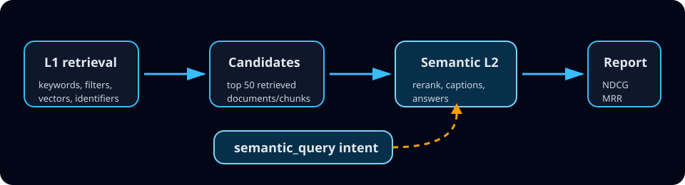

# Semantic Query Experiment

This repository is a reproducible experiment for evaluating the Azure AI Search
`semantic_query` parameter. The goal is to measure when separating the L1
retrieval query from the L2 semantic-ranking intent improves ranking, captions,
and answer-bearing passage selection.

Public Microsoft material documents semantic ranking and hybrid retrieval
experiments broadly. This project focuses specifically on scenarios where the
`semanticQuery` request field changes the semantic intent independently from the
base retrieval query.



## What this tests

The experiment compares conventional search approaches against arms that use a
separate semantic query:

1. BM25 keyword retrieval.
2. Vector-only retrieval.
3. Hybrid retrieval.
4. Hybrid retrieval with conventional semantic ranking.
5. Hybrid retrieval with `semantic_query` controls.
6. Hybrid retrieval with deterministic separate semantic intent.
7. Hybrid retrieval with LLM-rewritten semantic intent.

The synthetic corpus uses pharmaceutical manufacturing quality and GxP
compliance documents because the domain naturally contains identifiers, jargon,
acronyms, synonyms, fielded constraints, and answer-bearing prose.

## Repository status

This repo is being built in phases. The current foundation includes:

- `uv` package management.
- Python source and test layout.
- schema-first artifact models.
- validation workflow scaffolding.
- safe, non-provisioning placeholders for Azure workflows.
- initial diagrams and conventions.

No Azure resources are deployed by the placeholder workflows in this phase.

## Quickstart

Install `uv`, then run:

```powershell
uv sync --locked --all-groups
uv run ruff format --check .
uv run ruff check .
uv run pyright
uv run pytest
```

Run the placeholder CLI:

```powershell
uv run semqry --help
uv run semqry-preflight
```

## Experiment configuration

The single experiment configuration lives at:

```text
infra/config/experiment.json
```

Local secrets and Azure resource values should be provided through environment
variables. Use `.env.example` as the template and never commit `.env`.

## Reproducibility principles

- All generated JSONL artifacts include `schema_version`.
- Random generation must accept and log a seed.
- Query arms must log request parameters, API version, region, model deployment,
  and query rewrite state.
- Reports must include raw artifacts, paired metrics, confidence intervals, and
  failure cases.
- The experiment preregistration is maintained in
  [`docs/preregistration.md`](docs/preregistration.md).

## Diagrams

Visual assets are hand-authored SVG files under `assets/`. GitHub supports SMIL
and CSS animation in SVG, but scripts are intentionally not used.

## Teardown

Cost-bearing infrastructure will be added in a later phase. The `teardown`
workflow is currently a safe placeholder. When provisioning is implemented,
teardown instructions and confirmation gates will be kept prominent.
