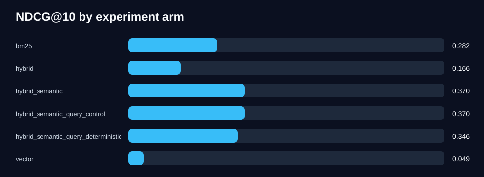

# Semantic query experiment report

Queries: `3334`  
Ranked result records: `1000200`

## Primary contrast

Hybrid semantic query deterministic minus identical-control NDCG@10 delta: `-0.0237`

## Aggregate metrics by arm

| Arm | NDCG@10 | NDCG@3 | MRR@10 | Recall@50 | Hit@1 | Latency ms |
| --- | ---: | ---: | ---: | ---: | ---: | ---: |
| `bm25` | 0.2823 | 0.2585 | 0.2196 | 0.4384 | 0.0612 | 244.3 |
| `hybrid` | 0.1657 | 0.1229 | 0.1764 | 0.4505 | 0.1419 | 549.1 |
| `hybrid_semantic` | 0.3698 | 0.3397 | 0.3822 | 0.4505 | 0.3503 | 582.8 |
| `hybrid_semantic_query_control` | 0.3698 | 0.3397 | 0.3822 | 0.4505 | 0.3503 | 582.6 |
| `hybrid_semantic_query_deterministic` | 0.3461 | 0.2802 | 0.3383 | 0.4505 | 0.2564 | 582.9 |
| `vector` | 0.0495 | 0.0279 | 0.0461 | 0.1529 | 0.0198 | 321.0 |

## Notes

- Results are from a synthetic GxP corpus with generator-asserted labels.
- The primary comparison is paired by query.
- The LLM rewrite arm is intentionally excluded until rewrite prompts are frozen.
